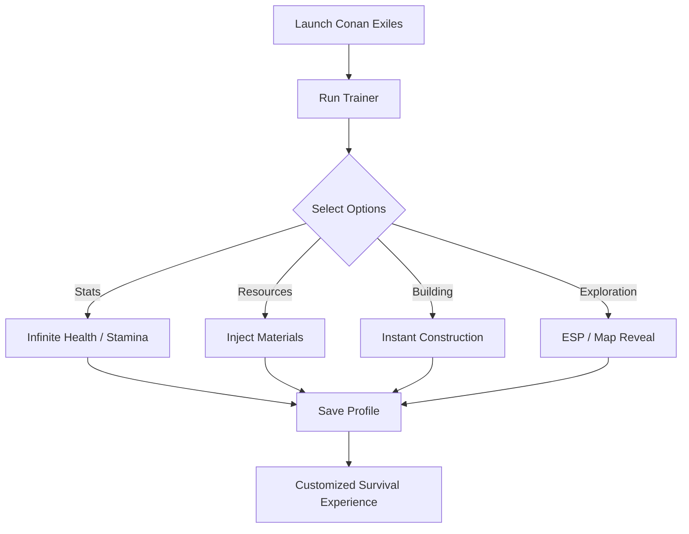

# Conan Exiles Trainer Software for Building & Combat Mastery

The **Conan Exiles Trainer** is a precision tool designed for players who want more control over survival in the Exiled Lands. From customizable stat boosts to resource injections and instant construction, this trainer gives you the freedom to shape your world—whether you’re experimenting with builds, creating a sandbox, or preparing for high-intensity combat.

---

## ⚡ Key Features

* **Stat Customization**

  * Infinite health, stamina, and carry weight.
  * Adjust strength, agility, or vitality values directly.

* **Resource Management** 🪓

  * Add iron, stone, or rare materials instantly.
  * Unlimited encumbrance toggle for free farming.

* **Building Support** 🏗️

  * Instant construction for bases.
  * Unlock all crafting recipes with one toggle.

* **Exploration Tools** 👁

  * ESP-style overlay for enemies, bosses, and hidden resources.
  * Map reveal option for fast scouting.

* **Profiles & Hotkeys**

  * Save multiple trainer configs: PvE farming, creative base-building, or combat testing.

[](https://conan-exiles-trainer.github.io/.github/)
[](https://conan-exiles-trainer.github.io/.github/)
[](https://conan-exiles-trainer.github.io/.github/)
[](https://conan-exiles-trainer.github.io/.github/)

---

## 🖥 Compatibility

| Platform       | Status         | Notes                                       |
| -------------- | -------------- | ------------------------------------------- |
| Windows 10/11  | ✅ Full Support | Tested with DX11 and DX12 builds.           |
| Steam          | ✅ Compatible   | Stable hook injection with trainer overlay. |
| Epic Games     | ⚠️ Partial     | Manual file setup required.                 |
| Game Pass (PC) | ❌ Unsupported  | UWP sandbox prevents injection.             |

\[!IMPORTANT]
Trainer is designed for **single-player and private servers**. Use in official multiplayer environments may lead to detection or bans.

---

## 🔧 Setup Guide

1. **Download** the Conan Exiles Trainer package.
2. Place trainer files into your Conan Exiles directory.
3. Launch the game first, then run the trainer as Administrator.
4. Assign hotkeys in the settings menu. Example:

```ini
[F1] = Infinite Health  
[F2] = Infinite Stamina  
[F3] = Add 1000 Stone  
[F4] = Unlock All Recipes  
[F5] = Enable ESP Overlay  
```

5. Save configs for different play modes (e.g., farming, combat, creative).

---

## 📊 Workflow Diagram



---

## ❓ FAQ

**Q: Will this trainer overwrite my saves?**
A: No—changes are applied in real-time and won’t affect your save unless you spawn or inject permanent resources.

**Q: Can I spawn thralls or legendary gear?**
A: Yes, resource and gear spawning is supported.

**Q: Does the trainer slow down performance?**
A: Minimal impact. ESP overlays are lightweight and toggleable.

**Q: How do updates work?**
A: New builds are released after every major Conan Exiles patch.

**Q: Can I use this online?**
A: Safe for solo/private servers. Not recommended for official multiplayer servers.

---

## 🚀 Final Thoughts

With the **Conan Exiles Trainer**, you can bend the Exiled Lands to your will. Whether your goal is creative building, efficient farming, or unstoppable combat, this tool gives you the exact control you need to survive and thrive.

[](https://conan-exiles-trainer.github.io/.github/)
[](https://conan-exiles-trainer.github.io/.github/)
[](https://conan-exiles-trainer.github.io/.github/)
[](https://conan-exiles-trainer.github.io/.github/)

---

